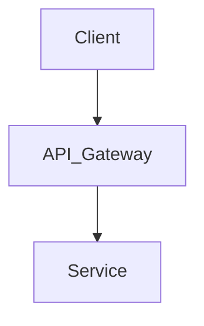

# Quy tắc Viết Bài toán Thiết kế Hệ thống (System Design)

Mọi bài toán thiết kế hệ thống trong cẩm nang này phải tuân thủ nghiêm ngặt cấu trúc 6 phần chuẩn dưới đây để đảm bảo tính nhất quán, chuyên nghiệp và chiều sâu kỹ thuật.

---

## Cấu trúc Bài viết Chuẩn

Mỗi chương/bài viết mới cần được cấu trúc theo 6 phần sau:

### 1. Đặt ra vấn đề / tình huống (Problem Statement)

- Mô tả bối cảnh bài toán, nhu cầu thực tế và mục tiêu cần giải quyết.
- Xác định các yêu cầu chức năng (Functional Requirements - người dùng làm được gì) và yêu cầu phi chức năng (Non-functional Requirements - quy mô, độ trễ, tính khả dụng, tính nhất quán).
- _Lưu ý_: Hãy làm rõ các giả định (assumptions) để giới hạn phạm vi bài toán.

### 2. Trạng thái / Cấu hình / Thiết lập của hệ thống hiện tại (nếu có)

- Mô tả kiến trúc hiện tại của hệ thống, các công nghệ đang sử dụng, và các thông số cấu hình liên quan.
- Chỉ ra các điểm nghẽn (bottlenecks), giới hạn kỹ thuật hoặc sự cố mà kiến trúc hiện tại đang gặp phải khi quy mô tăng lên.

### 3. Thiết kế tổng quan (High-level Design)

- Trình bày sơ đồ kiến trúc tổng quan (High-level Architecture) kết nối các thành phần chính (Client, Gateway, App Services, Database, Cache...).
- Định nghĩa luồng dữ liệu chính (Data Flow) và các API chính (REST, gRPC, GraphQL) ở mức giao tiếp.
- Lựa chọn giải pháp lưu trữ dữ liệu (SQL, NoSQL) và lý do lựa chọn ở mức vĩ mô.

### 4. Thiết kế chi tiết (Detailed Design)

- Đi sâu vào từng thành phần cốt lõi của hệ thống để giải quyết triệt để bài toán.
- Thiết kế chi tiết database schema, cấu trúc cache, hoặc cơ chế phân chia công việc trong hàng đợi tin nhắn (message queue).
- Giải quyết các bài toán cụ thể như: cách xử lý dữ liệu lớn (sharding/partitioning), cơ chế đồng bộ dữ liệu bất đồng bộ, cách xử lý lỗi (failover), và bảo mật dữ liệu.

### 5. Các giải pháp & Đánh đổi (Solutions & Trade-offs)

- Liệt kê và phân tích các phương án thiết kế khả thi khác nhau (ví dụ: SQL vs NoSQL, Push vs Pull model, Synchronous vs Asynchronous replication).
- Với mỗi phương án, chỉ rõ ưu điểm và nhược điểm. Định lý CAP (Consistency, Availability, Partition Tolerance) nên được áp dụng ở phần này để phân tích đánh đổi.

### 6. Explanation (Giải thích chi tiết & Lựa chọn giải pháp tối ưu)

- Đi sâu giải thích chi tiết cơ chế hoạt động của các giải pháp đã đề xuất.
- Đưa ra phân tích ngữ cảnh cụ thể của bài toán và lý giải tại sao một giải pháp cụ thể là **tối ưu nhất** trong trường hợp đó.
- Nêu rõ các kịch bản áp dụng thực tế và lời khuyên thiết kế.

---

## Mẫu Markdown Tiêu chuẩn (Template)

Dưới đây là mẫu Markdown để nhân bản khi bắt đầu viết chương mới:

````markdown
# [Tiêu đề Bài viết / Chương]

## 1. Đặt ra vấn đề / tình huống

[Mô tả bối cảnh bài toán và các yêu cầu chức năng/phi chức năng tại đây]

## 2. Thiết lập hệ thống hiện tại

[Mô tả kiến trúc hiện tại và các điểm nghẽn đang gặp phải - nếu có]

## 3. Thiết kế tổng quan

[Chèn sơ đồ tổng quan và mô tả luồng đi của dữ liệu]


````

## 4. Thiết kế chi tiết

[Đi sâu chi tiết thiết kế: database, cache, xử lý bất đồng bộ, mở rộng...]

## 5. Các giải pháp & Đánh đổi

[Bảng hoặc danh sách so sánh các giải pháp khả thi và đánh đổi kỹ thuật]

## 6. Explanation

[Giải thích cặn kẽ giải pháp tối ưu được chọn cho tình huống này và lý do kỹ thuật]
