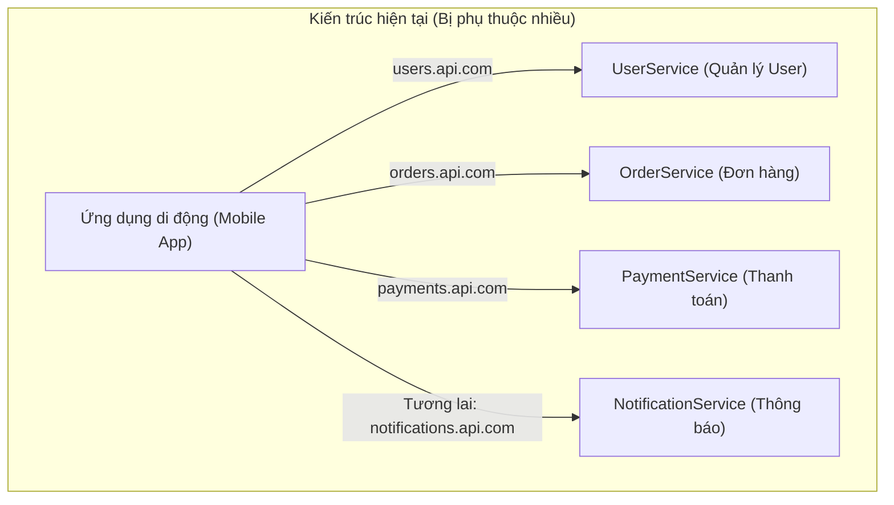
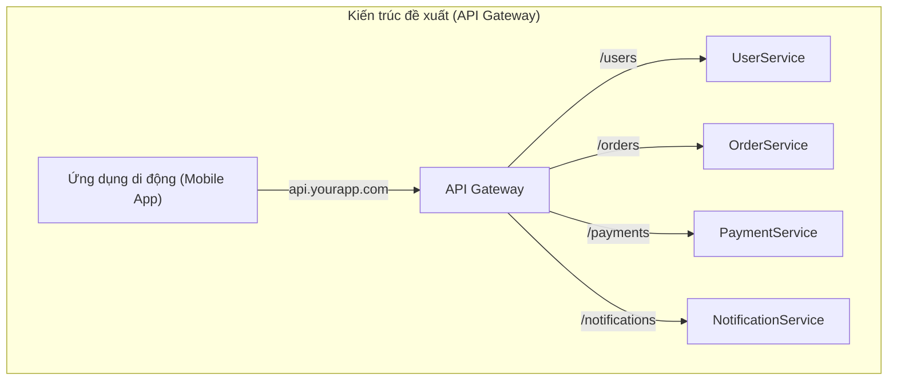
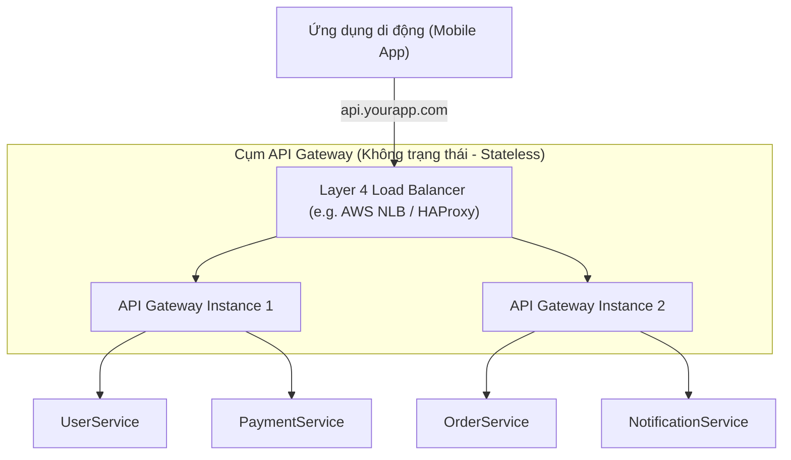

# Bài toán 01: Tách biệt Mobile khỏi các dịch vụ Backend (Decoupling Mobile from Backend Services)

---

## 1. Đặt ra vấn đề / tình huống (Problem Statement)

Ứng dụng di động của bạn đang kết nối trực tiếp với 3 dịch vụ backend riêng biệt. Một dịch vụ thứ 4 chuẩn bị được triển khai trong sprint tới. Đội ngũ phát triển ứng dụng di động đang cảm thấy quá tải: mỗi khi có một dịch vụ mới, họ lại phải thêm domain đó vào danh sách trắng (whitelist), cấu hình cơ chế xác thực (authentication scheme) mới, và xử lý một định dạng lỗi (error shape) hoàn toàn mới.

Bạn được yêu cầu giảm thiểu sự phụ thuộc trực tiếp (decouple) này trước khi dịch vụ thông báo (`NotificationService`) được đưa vào vận hành.

### Câu hỏi trắc nghiệm

Lựa chọn kiến trúc nào sau đây là tối ưu nhất để giải quyết vấn đề trên?

- **A.** Thêm một **API Gateway** — điểm truy cập duy nhất, ẩn tất cả các dịch vụ phía sau một domain duy nhất.
- **B.** Xây dựng **BFF (Backend for Frontend)** — một lớp tổng hợp dữ liệu (aggregation layer) riêng biệt được thiết kế tối ưu cho mobile.
- **C.** Đặt một **Load Balancer** phía trước tất cả các dịch vụ — một IP duy nhất, phân phối lưu lượng truy cập.
- **D.** Chuyển sang **GraphQL Federation** — một schema thống nhất duy nhất mà client sẽ truy vấn.

**ĐÁP ÁN ĐÚNG:** **A. Thêm một API Gateway**

---

## 2. Trạng thái / Cấu hình của hệ thống hiện tại

Hiện tại, Client (ứng dụng di động) đang phải tự thực hiện việc định tuyến (routing) bằng cách gọi trực tiếp tới các domain khác nhau. Đây là việc đáng lẽ ra phải thuộc về trách nhiệm của phía Backend.

- Mobile &rarr; `UserService` (`users.api.com`)
- Mobile &rarr; `OrderService` (`orders.api.com`)
- Mobile &rarr; `PaymentService` (`payments.api.com`)
- ...và `NotificationService` chuẩn bị ra mắt vào sprint tới (`notifications.api.com`).



**Các hạn chế lớn của kiến trúc hiện tại:**

- **Phình to Domain (Domain Sprawl):** Client phải cấu hình DNS, SSL/TLS handshake riêng cho từng domain, gây tăng độ trễ và khó quản lý.
- **Tách rời cơ chế bảo mật:** Mỗi dịch vụ phải tự triển khai kiểm tra Access Token (JWT), dẫn đến trùng lặp code và rủi ro bảo mật không đồng nhất.
- **Tăng chi phí bảo trì:** Khi có bất kỳ sự thay đổi nào về cấu trúc mạng backend (ví dụ: tách nhỏ một service), đội phát triển Mobile buộc phải phát hành phiên bản ứng dụng mới.

---

## 3. Thiết kế tổng quan (High-level Design)

Để giải quyết triệt để sự liên kết chặt chẽ (tight coupling) giữa Client và Backend, chúng ta đưa vào một **API Gateway** làm điểm đầu mối duy nhất (Single Point of Entry) cho mọi kết nối từ Mobile.



**Luồng dữ liệu hoạt động:**

1. Client gửi request duy nhất tới domain `api.yourapp.com` với đường dẫn tài nguyên cụ thể (ví dụ: `api.yourapp.com/orders`).
2. API Gateway tiếp nhận yêu cầu, thực thi các kiểm tra bảo mật (Auth validation) và giới hạn tần suất (Rate Limiting).
3. API Gateway dựa trên bảng định tuyến nội bộ để chuyển tiếp yêu cầu đến dịch vụ backend tương ứng (ví dụ: `OrderService` chạy trong mạng nội bộ).
4. Phản hồi từ backend được API Gateway chuyển ngược lại cho Client.

---

## 4. Thiết kế chi tiết (Detailed Design)

### 4.1. Centralizing Cross-Cutting Concerns (Tập trung hóa các tác vụ chung)

API Gateway giúp giải phóng các dịch vụ backend khỏi các tác vụ không thuộc về logic nghiệp vụ chính (cross-cutting concerns):

- **Xác thực tập trung (Centralized Authentication):** Xác thực JWT Token ngay tại Gateway. Nếu hợp lệ, Gateway giải mã thông tin user (ví dụ: `user_id`, `roles`) và truyền tiếp qua HTTP Header xuống các service nội bộ.
- **Giới hạn tần suất (Rate Limiting):** Sử dụng các thuật toán như _Token Bucket_ hoặc _Leaky Bucket_ ở Gateway để chặn đứng các cuộc tấn công DDoS/Brute-force trước khi chúng chạm tới các service backend.
- **Giải mã SSL/TLS (SSL/TLS Termination):** Gateway đảm nhận việc mã hóa/giải mã SSL. Kết nối từ Gateway tới các service nội bộ có thể đi qua giao thức HTTP thường để giảm tải CPU cho các service backend.

### 4.2. Mã giả cấu hình định tuyến (Pseudo Routing Configuration)

Cấu hình định tuyến tại Gateway được thiết lập khai báo (declarative syntax) như sau:

```yaml
# api_gateway_config.yml
gateway:
  host: api.yourapp.com
  port: 443
  ssl:
    enabled: true
    cert: /etc/ssl/certs/api_gateway.crt

  # Bộ lọc chung áp dụng cho mọi request trước khi định tuyến
  global_filters:
    - type: AuthenticationFilter
      action: Decode_JWT_and_Inject_Headers
    - type: RateLimitFilter
      limit_per_minute: 100
      algorithm: TokenBucket

  # Bảng định tuyến chi tiết sang các dịch vụ nội bộ
  routes:
    - path: /users/**
      target: http://user-service.internal:8080
      strip_prefix: true

    - path: /orders/**
      target: http://order-service.internal:8081
      strip_prefix: true

    - path: /payments/**
      target: http://payment-service.internal:8082
      strip_prefix: true

    - path: /notifications/**
      target: http://notification-service.internal:8083
      strip_prefix: true
```

### 4.3. Giải quyết Điểm nghẽn duy nhất (Single Point of Failure - SPOF)

Do API Gateway đón nhận toàn bộ lưu lượng truy cập, nếu Gateway này gặp sự cố sập (down), toàn bộ hệ thống sẽ mất kết nối. Để giải quyết rủi ro này, kiến trúc sản xuất thực tế cần kết hợp:



1. **Khởi chạy cụm Gateway (Gateway Clustering):** Chạy nhiều thực thể (instances) API Gateway không trạng thái (stateless) song song.
2. **Cân bằng tải lớp 4 (L4 Load Balancer):** Đặt một Load Balancer hoạt động ở tầng Transport (như AWS NLB) phía trước cụm Gateway để phân phối tải dựa trên kết nối TCP. L4 Load Balancer cực kỳ nhẹ, chịu tải rất lớn và hiếm khi gặp lỗi so với Gateway xử lý ở tầng ứng dụng (L7).

---

## 5. Các giải pháp & Đánh đổi (Solutions & Trade-offs)

Dưới đây là bảng so sánh chi tiết giữa các giải pháp được đề xuất trong câu hỏi trắc nghiệm:

| Giải pháp                                    | Tầng hoạt động          | Khả năng định hợp dữ liệu (Aggregation)             | Độ phức tạp triển khai | Điểm mạnh cốt lõi                                                      | Nhược điểm / Đánh đổi                                                               |
| :------------------------------------------- | :---------------------- | :-------------------------------------------------- | :--------------------- | :--------------------------------------------------------------------- | :---------------------------------------------------------------------------------- |
| **API Gateway** (Phương án A)                | Lớp 7 (Application)     | Thấp (chỉ định tuyến cơ bản)                        | Thấp - Trung bình      | Dễ triển khai, tập trung bảo mật tốt, gỡ bỏ domain sprawl nhanh chóng. | Tạo ra SPOF nếu không scale cụm và dùng LB L4 phía trước.                           |
| **BFF (Backend for Frontend)** (Phương án B) | Lớp 7 (Application)     | Rất cao (resphaping payload cho từng loại thiết bị) | Cao                    | Tối ưu hóa tối đa băng thông cho Mobile, gom nhiều API call thành 1.   | Phải code và bảo trì một dịch vụ độc lập; tăng gánh nặng phát triển.                |
| **Load Balancer** (Phương án C)              | Lớp 4/7 (Transport/App) | Không có                                            | Rất thấp               | Cân bằng tải hiệu năng cực cao, tăng tính sẵn sàng cho cụm server.     | Không thể định tuyến thông minh dựa trên đường dẫn logic của các service khác nhau. |
| **GraphQL Federation** (Phương án D)         | Lớp 7 (GraphQL Router)  | Rất cao (kết nối schema thành đồ thị duy nhất)      | Rất cao                | Schema hợp nhất hoàn chỉnh, client chủ động lấy đúng thứ mình cần.     | Phải chuyển toàn bộ REST sang GraphQL, độ dốc học tập (learning curve) lớn.         |

---

## 6. Explanation (Giải thích chi tiết & Lựa chọn tối ưu)

### Tại sao API Gateway (A) là lựa chọn tối ưu nhất cho tình huống này?

Mục tiêu cấp bách của đội Mobile trong sprint này là **ngăn chặn sự phình to domain (domain sprawl)** và **gỡ bỏ sự phụ thuộc trực tiếp** khi dịch vụ `NotificationService` chuẩn bị ra mắt.

- API Gateway giải quyết bài toán này nhanh nhất (thường có thể triển khai cấu hình trong vài giờ bằng các phần mềm có sẵn như Kong, APISix, hoặc AWS API Gateway).
- Chi phí tích hợp `NotificationService` tiếp theo ở phía client là **bằng 0**. Client chỉ cần gọi qua `/notifications` mà không cần đổi domain, cấu hình SSL mới, hay whitelist IP mới.

### Phân tích chi tiết các lựa chọn không tối ưu

- **BFF (B. Backend for Frontend) - Đúng công cụ, sai thời điểm:**
  BFF là mô hình tối ưu khi bạn cần giải quyết việc tối ưu hóa payload dữ liệu (ví dụ: gộp kết quả của `UserService` và `OrderService` thành một response duy nhất cho màn hình Mobile để tránh tạo quá nhiều network request). Tuy nhiên, dựng BFF yêu cầu bạn phải code logic kết hợp API, quản lý code repository mới, CI/CD riêng. Cho nhu cầu gỡ bỏ liên kết domain hiện tại, BFF là quá dư thừa và tốn kém nguồn lực.
- **Load Balancer (C. Cân bằng tải) - Thiếu tính năng định tuyến ứng dụng:**
  Load Balancer truyền thống (như L4 Load Balancer) chỉ phân phối lưu lượng của cùng một dịch vụ ra các instance phía sau. Nó không có khả năng đọc path HTTP để phân biệt yêu cầu `/orders` và `/users` để đẩy sang hai cụm server khác nhau.
- **GraphQL Federation (D. GraphQL thống nhất) - Quá phức tạp:**
  Đây là kiến trúc dài hạn tuyệt vời cho các tập đoàn lớn có hàng trăm microservices. Tuy nhiên, nó bắt buộc bạn phải thay đổi toàn bộ kiến trúc giao tiếp của các dịch vụ backend hiện tại sang GraphQL. Điều này không khả thi đối với bài toán cần giải quyết ngay trong 1-2 sprint tiếp theo của dự án.
