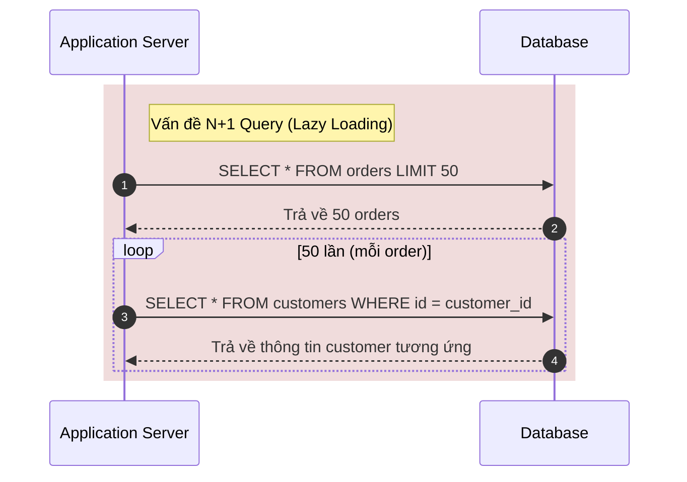
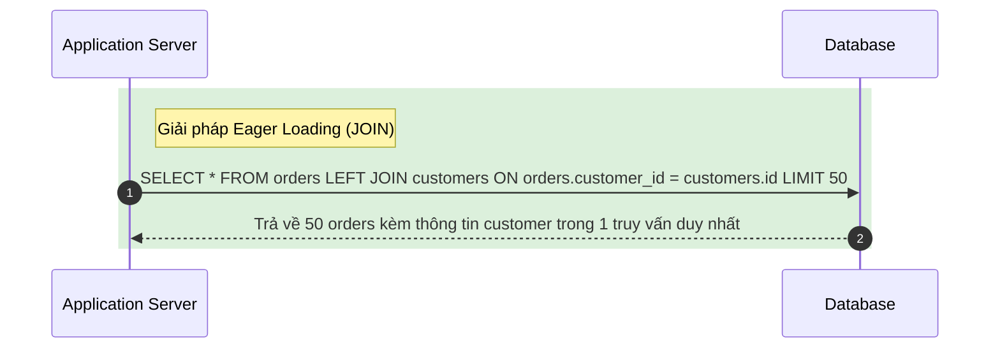

# Bài toán 02: Tiêu diệt vấn đề truy vấn N+1 (Killing the N+1 Query Problem)

---

## 1. Đặt ra vấn đề / tình huống (Problem Statement)

Endpoint `/orders` của bạn tải 50 đơn hàng trên một trang. Chỉ số thời gian phản hồi P95 hiện tại là 2.4 giây. Cơ sở dữ liệu và máy chủ ứng dụng vẫn hoạt động bình thường, không có dấu hiệu quá tải.

Tuy nhiên, khi mở nhật ký truy vấn (query log), bạn phát hiện ra một điều đáng ngại: có tới **51 truy vấn cơ sở dữ liệu** được thực hiện cho mỗi request.

1. Truy vấn `SELECT` đầu tiên để lấy danh sách 50 đơn hàng.
2. 50 truy vấn tiếp theo — mỗi truy vấn lấy thông tin chi tiết của một khách hàng (`customer`) ứng với mỗi đơn hàng.

Nguyên nhân là do ORM đang thực hiện cơ chế tải chậm (lazy-load) thực thể liên quan `order.customer` bên trong vòng lặp map dữ liệu của bạn.

Đây là lỗi N+1 truy vấn kinh điển. Việc khắc phục tưởng chừng đơn giản cho đến khi đội ngũ kỹ sư đưa ra các đề xuất khác nhau để giải quyết triệt để vấn đề này.

### Câu hỏi trắc nghiệm

Lựa chọn kiến trúc nào sau đây là tối ưu nhất để giải quyết vấn đề trên?

- **A.** **Eager-load quan hệ** — cấu hình `{ include: { customer: true } }` trong câu lệnh truy vấn Prisma. Thực hiện một phép JOIN duy nhất.
- **B.** Sử dụng **DataLoader** cho phần tìm kiếm thông tin khách hàng — DataLoader sẽ tự động gom 50 ID khách hàng và thực hiện một truy vấn `WHERE id IN (...)` chạy ngầm.
- **C.** Caching thông tin khách hàng theo ID trong **Redis** — kiểm tra cache trước khi truy vấn DB, chỉ truy vấn DB khi miss cache.
- **D.** **Phi chuẩn hóa (Denormalize)** trường `customer_name` trực tiếp vào bảng `orders` — đọc trực tiếp từ bảng `orders` mà không cần JOIN hay thực hiện truy vấn thứ hai.

**ĐÁP ÁN ĐÚNG:** **A. Eager-load quan hệ (Thực hiện JOIN)**

---

## 2. Trạng thái / Cấu hình của hệ thống hiện tại (Current System State / Configuration)

Hiện tại, mã nguồn ứng dụng đang sử dụng mô hình tải chậm (Lazy Loading) để truy xuất dữ liệu liên quan. ORM (Object-Relational Mapping) chỉ tải dữ liệu của bảng chính (`orders`) trước, và mỗi khi vòng lặp lặp qua từng phần tử để truy cập thuộc tính `order.customer`, ORM lại âm thầm phát ra thêm một truy vấn SQL phụ để lấy dữ liệu từ bảng `customers`.



### Các hạn chế lớn của kiến trúc hiện tại

- **Hiện tượng mạng chập chờn / Độ trễ tăng tích lũy (Network Round-trips):** 51 network round-trips giữa Application Server và Database Server sẽ tích tụ độ trễ mạng cực kỳ lớn. Với độ trễ mạng trung bình chỉ 5ms/truy vấn, tổng thời gian phản hồi đã mất ít nhất 250ms chỉ để chờ mạng.
- **Quá tải Connection Pool:** Số lượng kết nối và truy vấn gửi tới Database tăng vọt đột biến cho một yêu cầu duy nhất từ client. Khi có nhiều request đồng thời, Database Connection Pool sẽ nhanh chóng bị cạn kiệt, dẫn đến nghẽn cổ chai toàn bộ hệ thống.
- **Khó mở rộng (Scalability):** Độ trễ của endpoint tăng tuyến tính (O(N)) theo số lượng bản ghi hiển thị trên mỗi trang.

---

## 3. Thiết kế tổng quan (High-level Design)

Để giải quyết vấn đề, chúng ta cần chuyển đổi cơ chế nạp dữ liệu từ **Tải chậm (Lazy Loading)** sang **Tải trước (Eager Loading)**. Với Eager Loading, máy chủ ứng dụng sẽ yêu cầu ORM gộp các thực thể liên quan lại với nhau ngay trong truy vấn đầu tiên bằng cách sử dụng phép toán `JOIN` của cơ sở dữ liệu quan hệ.



**Luồng dữ liệu hoạt động:**

1. Client gửi yêu cầu lấy danh sách đơn hàng đến ứng dụng.
2. Ứng dụng gửi duy nhất một truy vấn chứa phép `JOIN` tới cơ sở dữ liệu.
3. Cơ sở dữ liệu xử lý phép JOIN ở mức vật lý, tối ưu hóa đường đi của chỉ mục (Index) và trả về tập dữ liệu hợp nhất.
4. Ứng dụng ánh xạ (map) tập dữ liệu trả về và gửi phản hồi lại cho Client trong 1 vòng kết nối duy nhất.

---

## 4. Thiết kế chi tiết (Detailed Design)

### 4.1. Ví dụ mã nguồn lỗi (Lazy Loading) và sửa lỗi (Eager Loading)

#### TypeScript với Prisma ORM

Dưới đây là sự khác biệt trong mã nguồn TypeScript khi sử dụng Prisma:

**Đoạn code gây lỗi N+1 (Lazy-load):**

```typescript
// Lấy danh sách 50 orders
const orders = await prisma.order.findMany({
  take: 50,
});

// Duyệt qua từng order để lấy customer name -> Gây thêm 50 truy vấn SQL phụ
const result = orders.map((order) => ({
  id: order.id,
  amount: order.amount,
  customerName: order.customer.name, // Prisma sẽ âm thầm gọi DB nếu quan hệ chưa được nạp
}));
```

**Đoạn code đã sửa (Eager-load):**

```typescript
// Sử dụng include để JOIN bảng customers ngay trong 1 câu truy vấn
const orders = await prisma.order.findMany({
  take: 50,
  include: {
    customer: true, // Eager loading
  },
});

// Map dữ liệu không phát sinh thêm truy vấn DB nào khác
const result = orders.map((order) => ({
  id: order.id,
  amount: order.amount,
  customerName: order.customer.name, // Dữ liệu đã có sẵn trong bộ nhớ
}));
```

#### Java với Hibernate / JPA

Với dự án Java sử dụng Spring Data JPA / Hibernate, ta cấu hình như sau:

**Mô hình Entity mặc định dễ gây lỗi (Lazy Loading):**

```java
@Entity
public class Order {
    @Id
    private Long id;

    @ManyToOne(fetch = FetchType.LAZY) // Mặc định ManyToOne thường được thiết lập Lazy
    @JoinColumn(name = "customer_id")
    private Customer customer;
}
```

Nếu truy vấn bằng JPA Repository bình thường `orderRepository.findAll()`, khi gọi `order.getCustomer().getName()`, Hibernate sẽ kích hoạt N+1 query.

**Đoạn code đã sửa bằng Entity Graph hoặc JPQL Fetch Join:**

```java
// Cách 1: Sử dụng FETCH JOIN trong JPQL
@Query("SELECT o FROM Order o JOIN FETCH o.customer")
List<Order> findAllOrdersWithCustomer();

// Cách 2: Sử dụng EntityGraph
@EntityGraph(attributePaths = {"customer"})
List<Order> findAll(Pageable pageable);
```

### 4.2. Cơ chế SQL bên dưới

Khi thực hiện Eager Loading với phép JOIN, ORM sẽ biên dịch câu lệnh tương tự như sau:

```sql
SELECT
    o.id AS order_id,
    o.amount AS order_amount,
    c.id AS customer_id,
    c.name AS customer_name
FROM orders o
LEFT JOIN customers c ON o.customer_id = c.id
LIMIT 50;
```

Nhờ có Index được đánh trên trường `orders.customer_id` và khóa chính `customers.id`, Database Engine có thể thực hiện phép JOIN cực kỳ nhanh chóng.

---

## 5. Các giải pháp & Đánh đổi (Solutions & Trade-offs)

Dưới đây là bảng so sánh chi tiết giữa 4 giải pháp được đưa ra để khắc phục vấn đề N+1 truy vấn:

| Giải pháp                                | Tầng hoạt động       | Độ trễ (P95 Latency)                                                                | Tính nhất quán dữ liệu (Data Consistency)                                                          | Độ phức tạp triển khai & Bảo trì                                                             | Chi phí hạ tầng / Tài nguyên                                                                | Khả năng chịu lỗi (Fault Tolerance)                                                 |
| :--------------------------------------- | :------------------- | :---------------------------------------------------------------------------------- | :------------------------------------------------------------------------------------------------- | :------------------------------------------------------------------------------------------- | :------------------------------------------------------------------------------------------ | :---------------------------------------------------------------------------------- |
| **Eager Loading (JOIN)** _(Phương án A)_ | ORM / Database Layer | **Rất thấp (~80ms)**. Chỉ tốn 1 network round-trip.                                 | **Tuyệt đối**. Đọc trực tiếp dữ liệu nhất quán từ DB qua transaction/query gốc.                    | **Rất thấp**. Chỉ cần cấu hình lại câu lệnh truy vấn của ORM.                                | **Không phát sinh chi phí**. Không cần cài đặt thêm phần cứng hay dịch vụ mới.              | **Rất cao**. Phụ thuộc hoàn toàn vào tính sẵn sàng của Database chính.              |
| **DataLoader** _(Phương án B)_           | Application Layer    | **Thấp**. Gom thành 2 truy vấn DB: 1 SELECT orders và 1 SELECT IN cho customers.    | **Cao**. Dữ liệu lấy trực tiếp từ DB nhưng trong các truy vấn riêng biệt.                          | **Trung bình**. Cần thiết lập context, batching function và quản lý vòng đời cache ngắn hạn. | **Thấp**. Phát sinh thêm một ít bộ nhớ RAM trên Application để lưu trữ batch data tạm thời. | **Cao**. Nếu DB hoặc App sập thì lỗi, không có thêm thành phần trung gian phức tạp. |
| **Redis Cache** _(Phương án C)_          | Caching Layer        | **Trung bình - Thấp**. Nếu hit cache sẽ nhanh, nhưng nếu miss cache sẽ phải gọi DB. | **Thấp**. Nguy cơ dữ liệu bị lệch (stale data). Cần quản lý cơ chế xóa cache (cache invalidation). | **Cao**. Phải viết logic kiểm tra cache, cập nhật cache, và xử lý bất đồng bộ.               | **Trung bình - Cao**. Cần vận hành và duy trì một cụm Redis Cache độc lập.                  | **Trung bình**. Thêm Redis tạo ra một điểm lỗi tiềm ẩn mới (new point of failure).  |
| **Denormalization** _(Phương án D)_      | Database Schema      | **Cực thấp**. Chỉ đọc 1 bảng duy nhất, không cần JOIN.                              | **Rất thấp**. Dữ liệu dễ bị không đồng bộ khi thông tin khách hàng thay đổi.                       | **Cao**. Phải xử lý logic cập nhật đồng bộ các trường phi chuẩn hóa ở nhiều bảng.            | **Thấp**. Tăng nhẹ dung lượng lưu trữ đĩa cứng do trùng lặp dữ liệu.                        | **Rất cao**. Không phụ thuộc vào bảng khác nhưng rủi ro sai lệch dữ liệu rất lớn.   |

---

## 6. Explanation (Giải thích chi tiết & Lựa chọn tối ưu)

### Tại sao Eager-load quan hệ (A) là giải pháp tối ưu nhất?

Trong bối cảnh bài toán, chúng ta có một trang danh sách hiển thị dữ liệu phẳng chứa thông tin đơn giản từ một quan hệ liên kết trực tiếp (`orders` và `customers`).

- **Độ phức tạp tối thiểu:** Giải pháp sửa đổi trực tiếp cấu hình ORM thông qua `include` (Prisma) hoặc `FETCH JOIN` (Hibernate) giúp giải quyết triệt để lỗi thiết kế mà không cần thêm bất kỳ thành phần hạ tầng nào mới (như Redis) hay viết thêm logic gom nhóm truy vấn phức tạp (như DataLoader).
- **Hiệu năng vượt trội:** Thay đổi cơ chế từ Lazy-load sang JOIN giảm số truy vấn từ 51 xuống còn **1 truy vấn duy nhất**, giúp tối ưu hóa thời gian phản hồi P95 xuống mức tối thiểu (từ 2.4 giây xuống còn ~80ms) nhờ loại bỏ hoàn toàn chi phí trễ mạng (network round-trip latency).

### Phân tích chi tiết các phương án không tối ưu

- **DataLoader (B) - Quá mức cần thiết (Overengineering):**
  DataLoader cực kỳ hữu ích trong GraphQL để giải quyết bài toán truy vấn lồng nhau (nested query) trên đồ thị dữ liệu phức tạp. Với một API REST lấy danh sách phẳng truyền thống, việc áp dụng DataLoader sẽ thêm độ phức tạp không đáng có vào mã nguồn (phải viết batching function, cấu hình middleware) và vẫn tạo ra ít nhất 2 truy vấn DB riêng biệt thay vì 1 phép JOIN tối ưu.
- **Redis Cache (C) - Giải quyết sai phần gốc:**
  Sử dụng cache trong trường hợp này chỉ giúp che giấu đi thiết kế truy vấn tồi chứ không sửa được bản chất lỗi N+1. Nếu cache bị lạnh (cold cache) hoặc bị xóa đồng loạt, hệ thống vẫn sẽ hứng chịu 51 truy vấn DB cho một request, dễ dẫn đến hiện tượng nghẽn cổ chai hoặc sập DB (Cache Stampede). Ngoài ra, chi phí quản lý tính nhất quán dữ liệu (Cache Invalidation) khi khách hàng đổi tên là rất phức tạp.
- **Denormalization (D) - Tối ưu hóa quá sớm (Premature Optimization):**
  Sao chép tên khách hàng vào bảng `orders` để tránh JOIN là một kỹ thuật tối ưu hóa ở quy mô khổng lồ (khi dữ liệu quá lớn không thể JOIN hiệu quả). Tuy nhiên, cái giá phải trả là sự mất mát về tính nhất quán dữ liệu (Data Integrity). Bạn sẽ phải thiết lập các trigger hoặc worker ngầm để cập nhật hàng loạt đơn hàng cũ mỗi khi khách hàng thay đổi tên, làm tăng đáng kể tải ghi (write-amplification) của hệ thống.
