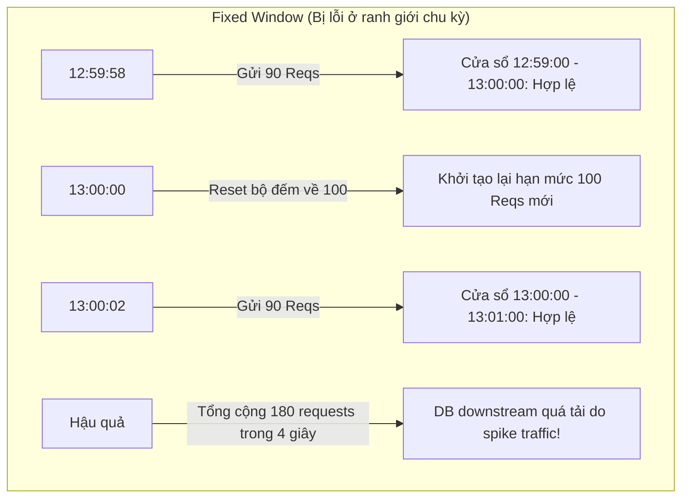
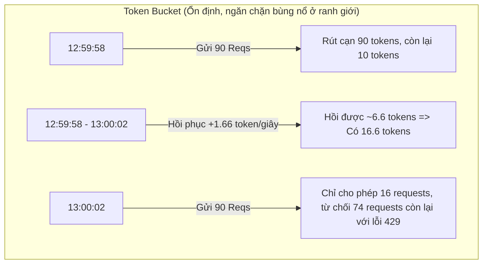

# Bài toán 03: Giới hạn tần suất yêu cầu không bị bùng nổ ở ranh giới (Rate Limiting Without Boundary Bursts)

---

## 1. Đặt ra vấn đề / tình huống (Problem Statement)

Bạn đang vận hành một dịch vụ SaaS API. Endpoint `POST /v1/messages` là nơi mang lại doanh thu chính của công ty.

Giới hạn của gói dịch vụ hiện tại là: **100 requests/phút** cho mỗi API key. Tuy nhiên, khách hàng liên tục phản ánh rằng họ gặp lỗi `429 Too Many Requests` ở các ranh giới phút (minute boundaries) dù tần suất trung bình (average RPS) của họ thấp hơn rất nhiều so với hạn mức cho phép.

**Những gì đang diễn ra trong hệ thống production:**

- **12:59:58** &rarr; Khách hàng kích hoạt một tiến trình chạy ngầm (batch job) và gửi **90 requests**.
- **13:00:00** &rarr; Bộ đếm thời gian của bạn được reset về 0 (chu kỳ phút mới bắt đầu).
- **13:00:02** &rarr; Cũng khách hàng đó gửi tiếp **90 requests** nữa.
- **Hậu quả:** Cả hai đợt bùng nổ này đều được chấp nhận thành công do bộ đếm đã reset. Tổng cộng có tới **180 requests được gửi đi chỉ trong 4 giây**, khiến cơ sở dữ liệu downstream của bạn bắt đầu quá tải và báo lỗi.

Bên chăm sóc khách hàng (Support) liên tục phàn nàn vì khách hàng bị chặn lỗi 429, trong khi đội vận hành (SRE) cũng hối thúc bạn khắc phục tình trạng spike traffic này. Bạn cần thay thế bộ rate limiter này ngay trong tuần.

### Câu hỏi trắc nghiệm

Lựa chọn kiến trúc nào sau đây là tối ưu nhất để giải quyết vấn đề trên?

- **A.** **Fixed Window (Cửa sổ cố định)** — lưu trữ bộ đếm cho mỗi cặp `(api_key, minute)`. Mỗi request sẽ tăng bộ đếm, kiểm tra và từ chối nếu vượt giới hạn. Đơn giản, nhanh chóng, chỉ cần 1 Redis key cho mỗi user.
- **B.** **Sliding Window Log (Nhật ký cửa sổ trượt)** — lưu trữ mọi timestamp của request vào Redis. Đếm số lượng request trong vòng 60s trước đó trên mỗi lượt gọi. Độ chính xác đến mili-giây.
- **C.** **Token Bucket (Thùng token)** — cấp 100 token cho mỗi key, hồi phục với tốc độ 100/60 token/giây (~1.66 token/giây). Mỗi request tiêu tốn 1 token. Cho phép bùng nổ tối đa 100 request, sau đó điều tiết lại.
- **D.** **Leaky Bucket (Thùng rò rỉ)** — đưa các request đi vào hàng đợi, xử lý chúng với tốc độ không đổi 1.66 req/giây. Các request vượt quá kích thước hàng đợi sẽ phải đợi hoặc bị loại bỏ.

**ĐÁP ÁN ĐÚNG:** **C. Token Bucket (Thùng token)**

---

## 2. Trạng thái / Cấu hình của hệ thống hiện tại (Current System State / Configuration)

Hệ thống hiện tại đang sử dụng thuật toán **Fixed Window (Cửa sổ cố định)** để giới hạn tần suất. Bộ đếm lưu trên Redis với một key có dạng `rate_limit:{api_key}:{yyyyMMddHHmm}` và có thời gian sống (TTL) là 60 giây.



### Các hạn chế lớn của kiến trúc hiện tại

- **Hiện tượng bùng nổ ranh giới (Boundary Bursts):** Do cửa sổ tính giờ cố định (ví dụ: từ phút 12:59 đến 13:00), nếu client dồn hết lượng request vào cuối cửa sổ thứ nhất và đầu cửa sổ thứ hai, lượng tải thực tế đi vào hệ thống downstream trong một khoảng thời gian cực ngắn (4 giây) sẽ tăng gấp đôi hạn mức cam kết.

- **Nguy cơ sập hệ thống downstream:** Các database hoặc service nội bộ thường được cấp tài nguyên vừa đủ dựa trên hạn mức lý thuyết (100 reqs/phút, tương đương 1.66 RPS). Việc xuất hiện luồng traffic 180 reqs/4s (45 RPS, gấp 27 lần trung bình) sẽ ngay lập tức làm nghẽn hoặc sập database downstream.

---

## 3. Thiết kế tổng quan (High-level Design)

Để khắc phục hiện tượng bùng nổ ranh giới, hệ thống cần được cấu trúc lại bằng thuật toán **Token Bucket (Thùng token)**. Thuật toán này không dùng cửa sổ thời gian cứng mà duy trì một lượng token linh hoạt có khả năng tự hồi phục theo thời gian.



**Luồng hoạt động tổng quan:**

1. Khi có request gửi tới, hệ thống tính toán số lượng token được hồi phục kể từ lần gọi cuối cùng dựa trên khoảng thời gian chênh lệch.
2. Thêm số token vừa hồi vào thùng (không vượt quá dung lượng tối đa là 100).
3. Nếu thùng còn đủ token cho request (ví dụ: cần 1 token), hệ thống trừ token và cho phép request đi tiếp. Ngược lại, trả về lỗi `429 Too Many Requests` ngay lập tức.

---

## 4. Thiết kế chi tiết (Detailed Design)

### 4.1. Cơ chế hồi token động (Lazy Refill / On-demand Calculation)

Thay vì chạy một luồng chạy ngầm (background scheduler) quét qua hàng trăm ngàn user để cộng token mỗi giây (gây tốn tài nguyên CPU vô ích), chúng ta sử dụng cơ chế **Lazy Refill**. Token chỉ được tính toán và hồi phục một cách lười biếng (on-demand) khi có request thực tế gửi đến của user đó.

Công thức tính số token hiện tại:

\\[
\text{tokens}\_{\text{current}} = \min\left(\text{capacity}, \text{tokens}\_{\text{last}} + \left(\text{timestamp}\_{\text{now}} - \text{timestamp}\_{\text{last}}\right) \times \text{refill}\_\text{rate}\right)
\\]

### 4.2. Triển khai phân tán với Redis Lua Script (TypeScript)

Để đảm bảo tính nguyên tử (Atomicity), tránh hiện tượng tranh chấp dữ liệu (Race Conditions) trong môi trường nhiều instance API Gateway chạy song song, logic Token Bucket được đóng gói thành một mã kịch bản **Lua Script** chạy trực tiếp trên Redis.

```lua
-- rate_limiter.lua
-- KEYS[1]: key giới hạn tần suất của user (ví dụ: rate_limit:user_123)
-- ARGV[1]: Dung lượng tối đa của thùng (capacity) (ví dụ: 100)
-- ARGV[2]: Tốc độ hồi token mỗi mili-giây (refill_rate) (ví dụ: 100 / 60000 = 0.00166)
-- ARGV[3]: Timestamp hiện tại bằng mili-giây (timestamp_now)
-- ARGV[4]: Số lượng token tiêu thụ cho mỗi request (cost) (thường là 1)

local key = KEYS[1]
local capacity = tonumber(ARGV[1])
local refill_rate = tonumber(ARGV[2])
local now = tonumber(ARGV[3])
local cost = tonumber(ARGV[4] or 1)

-- Lấy trạng thái hiện tại từ Redis Hash
local state = redis.call('HMGET', key, 'tokens', 'last_updated')
local tokens = tonumber(state[1])
local last_updated = tonumber(state[2])

if not tokens then
    -- Lần đầu tiên gọi, khởi tạo đầy thùng token
    tokens = capacity
    last_updated = now
else
    -- Hồi token dựa trên thời gian trôi qua giữa 2 request
    local delta = math.max(0, now - last_updated)
    local tokens_to_add = delta * refill_rate
    tokens = math.min(capacity, tokens + tokens_to_add)
    last_updated = now
end

-- Kiểm tra xem thùng còn đủ token hay không
if tokens >= cost then
    tokens = tokens - cost
    redis.call('HMSET', key, 'tokens', tokens, 'last_updated', last_updated)
    redis.call('EXPIRE', key, 120) -- Xóa key nếu không hoạt động sau 2 phút để tiết kiệm RAM
    return 1 -- Chấp nhận request (HTTP 200)
else
    -- Cập nhật lại số token đã hồi phục kể cả khi bị từ chối
    redis.call('HMSET', key, 'tokens', tokens, 'last_updated', last_updated)
    redis.call('EXPIRE', key, 120)
    return 0 -- Từ chối request (HTTP 429)
end
```

Mã nguồn Node.js gọi thực thi Lua script:

```typescript
import Redis from "ioredis";

const redis = new Redis();
const LUA_SCRIPT = `...[Đoạn mã Lua ở trên]...`;

async function isRateLimited(userId: string): Promise<boolean> {
  const key = `rate_limit:${userId}`;
  const now = Date.now();
  const capacity = 100;
  const refillRate = 100 / 60000; // 100 tokens / 60000ms

  // Thực thi script nguyên tử trên Redis
  const result = await redis.eval(
    LUA_SCRIPT,
    1,
    key,
    capacity,
    refillRate,
    now,
    1,
  );
  return result === 0; // Trả về true nếu bị rate limit
}
```

### 4.3. Triển khai trong ứng dụng Java với Bucket4j

Đối với các ứng dụng Java (ví dụ: Spring Boot Gateway), thư viện **Bucket4j** cung cấp khả năng triển khai Token Bucket mạnh mẽ, hỗ trợ cả bộ nhớ cục bộ (In-memory) lẫn phân tán (qua Hazelcast/GridGain).

```java
import io.github.bucket4j.Bandwidth;
import io.github.bucket4j.Bucket;
import io.github.bucket4j.Refill;
import java.time.Duration;
import org.springframework.stereotype.Service;

@Service
public class RateLimitService {

    // Khởi tạo một Bucket với dung lượng 100 và hồi đầy sau mỗi 1 phút (refill rate)
    private final Bucket bucket = Bucket.builder()
        .addLimit(Bandwidth.classic(100, Refill.intervally(100, Duration.ofMinutes(1))))
        .build();

    public boolean tryConsume() {
        // Tiêu tốn 1 token cho mỗi lượt gọi
        return bucket.tryConsume(1);
    }
}
```

---

## 5. Các giải pháp & Đánh đổi (Solutions & Trade-offs)

Dưới đây là bảng so sánh chi tiết giữa 4 giải pháp giới hạn tần suất được đưa ra:

| Giải pháp                              | Tầng hoạt động    | Độ trễ (Latency)                                                          | Tính chính xác & Ngăn burst ranh giới                                                          | Độ phức tạp triển khai & Bảo trì                                                        | Chi phí bộ nhớ / RAM                                                              | Khả năng chịu lỗi & Hành vi (Fault Tolerance / Behavior)                                   |
| :------------------------------------- | :---------------- | :------------------------------------------------------------------------ | :--------------------------------------------------------------------------------------------- | :-------------------------------------------------------------------------------------- | :-------------------------------------------------------------------------------- | :----------------------------------------------------------------------------------------- |
| **Fixed Window** _(Phương án A)_       | Redis/App         | Cực thấp (1 phép INCR và EXPIRE trên Redis)                               | **Kém**. Cho phép spike traffic gấp đôi hạn mức ở ranh giới chu kỳ.                            | Rất thấp. Cấu hình đơn giản.                                                            | Cực thấp. Chỉ cần 1 key Redis cho mỗi user theo từng phút.                        | Tốt. Nếu mất kết nối Redis, dễ dàng fallback cho qua hoặc block.                           |
| **Sliding Window Log** _(Phương án B)_ | Redis/App         | Cao. Phải đọc và ghi danh sách timestamp (ZADD, ZREMRANGEBYSCORE, ZCARD). | **Tuyệt đối**. Đếm chính xác số request trong đúng 60 giây gần nhất.                           | Trung bình. Cần quản lý cấu trúc dữ liệu Sorted Set (ZSET) phức tạp hơn.                | **Rất cao**. Mỗi request lưu 1 entry timestamp. RAM tăng tuyến tính theo traffic. | Trung bình. Tải xử lý trên Redis lớn dễ gây nghẽn p99 latency ở quy mô lớn.                |
| **Token Bucket** _(Phương án C)_       | Redis/App/Gateway | Thấp. Lua script thực thi cực nhanh trên Redis.                           | **Tốt**. Cho phép bùng nổ đến mức tối đa (capacity), sau đó điều tiết mượt mà theo tốc độ hồi. | Trung bình. Cần quản lý Lua script hoặc thư viện Bucket4j.                              | **Thấp**. Chỉ cần lưu 2 trường `tokens` và `last_updated` cho mỗi user.           | Rất tốt. Hỗ trợ phân tán nguyên tử hoàn hảo. Từ chối yêu cầu ngay lập tức (reject).        |
| **Leaky Bucket** _(Phương án D)_       | App/Gateway Layer | Tăng đáng kể đối với client do cơ chế queue.                              | **Tuyệt đối**. Traffic đầu ra đi vào hệ thống downstream luôn được giữ ở tốc độ cố định.       | Cao. Cần quản lý hàng đợi (queue) và worker bất đồng bộ để xử lý request theo hàng đợi. | Trung bình. Cần bộ nhớ để lưu hàng đợi đợi xử lý của các request.                 | Trung bình. Nếu queue đầy, request mới sẽ bị block. Trì hoãn xử lý (delay) thay vì reject. |

---

## 6. Explanation (Giải thích chi tiết & Lựa chọn tối ưu)

### Tại sao Token Bucket (C) là lựa chọn tối ưu nhất?

- **Khắc phục triệt để bùng nổ ranh giới:** Nhờ cơ chế hồi phục liên tục dạng tuyến tính, Token Bucket không có điểm "reset" đột ngột. Khi client dồn 90 requests vào giây cuối cùng (12:59:58), thùng sẽ bị rút cạn. Khi đợt tiếp theo đến ở giây 13:00:02, thùng chỉ kịp hồi phục lại khoảng 6.6 token, do đó 74 requests thừa sẽ bị chặn đứng ngay lập tức với mã lỗi `429`. Điều này triệt tiêu hoàn toàn rủi ro quá tải cho DB downstream.

- **Tối ưu hóa tài nguyên:** Tránh được thảm họa cạn kiệt bộ nhớ của Sliding Window Log nhờ việc lưu trữ thông tin không phụ thuộc vào số lượng request được gửi đi (chỉ lưu 2 trường trạng thái tĩnh `tokens` và `last_updated`).
- **Phản hồi tức thì (Fail-Fast):** So với Leaky Bucket (bắt client phải chờ đợi trong hàng đợi làm tăng độ trễ và giữ kết nối HTTP mở lâu gây tốn thread pool của server), Token Bucket từ chối yêu cầu vượt hạn mức ngay lập tức. Đây là hành vi chuẩn mực đối với các API Gateway public hướng đến khách hàng.

### Phân tích các lựa chọn không tối ưu khác

- **Sliding Window Log (B):** Dù giải quyết được bài toán ranh giới một cách chính xác tuyệt đối, nhưng việc sử dụng Redis Sorted Set để lưu trữ hàng triệu timestamp của request của hàng trăm ngàn khách hàng đồng thời sẽ ngốn sạch RAM của cụm Redis trong thời gian ngắn. Đây là lỗi thiết kế đánh đổi bộ nhớ lấy độ chính xác không cần thiết ở quy mô lớn.

- **Fixed Window (A):** Là thuật toán cũ đang chạy trên hệ thống sản xuất gặp lỗi. Việc tiếp tục sử dụng nó đồng nghĩa với việc chấp nhận rủi ro sập database downstream bất cứ lúc nào khi khách hàng chạy các tiến trình tự động (cron-jobs/batch tasks) đồng bộ.
- **Leaky Bucket (D):** Phù hợp để cài đặt trực tiếp phía trước các dịch vụ downstream yếu để bảo vệ chúng (traffic shaping). Tuy nhiên, nếu đặt ở API Gateway phía ngoài cùng, nó sẽ tạo ra trải nghiệm người dùng rất tệ vì các request hợp lệ cũng bị giữ lại trong hàng đợi và xử lý chậm rãi, thay vì phản hồi nhanh chóng cho người dùng.
