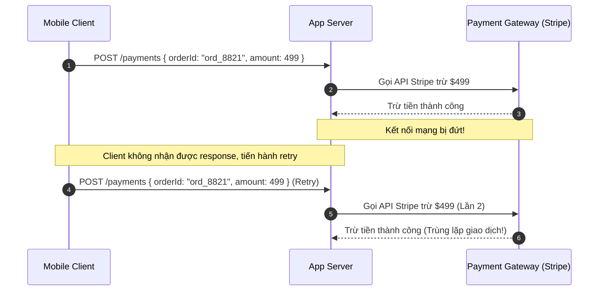
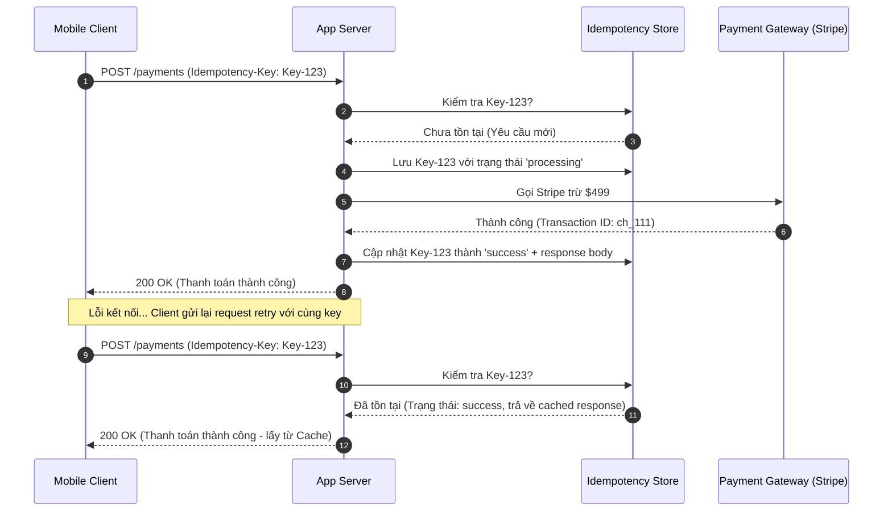

# Bài toán 04: Ngăn chặn trùng lặp giao dịch thanh toán (Preventing Duplicate Payment Charges)

---

## 1. Đặt ra vấn đề / tình huống (Problem Statement)

Một người dùng nhấn nút "Thanh toán $499" khi checkout. Trình duyệt/ứng dụng bị treo (hiển thị spinner). Họ sốt ruột và nhấn lại lần nữa, rồi thêm một lần nữa.

Ba yêu cầu gần như trùng lặp được gửi đến Payments API của bạn. Hai trong số đó xử lý thành công. Khách hàng bị trừ tổng cộng $1,497 và nhanh chóng mở một ticket khiếu nại trước khi kỹ sư trực vận hành (on-call) kịp nhận được cảnh báo.

**Thiết lập hiện tại:**

- Mobile &rarr; `POST /payments { orderId: "ord_8821", amount: 499 }`
- Mạng bị chập chờn ở request đầu tiên &rarr; client thực hiện retry 2 lần.
- Dịch vụ của bạn nhận được 3 request POST gần như giống hệt nhau trong vòng 4 giây.
- Cổng thanh toán (Stripe) thực hiện trừ tiền 3 lần. Cơ sở dữ liệu của bạn ghi nhận 3 dòng thanh toán khác nhau.

Bạn có một sprint để đảm bảo rằng các request được retry sẽ không bao giờ gây trừ tiền trùng lặp nữa. Bạn sẽ làm thế nào?

### Câu hỏi trắc nghiệm

Lựa chọn kiến trúc nào sau đây là tối ưu nhất để giải quyết vấn đề trên?

- **A.** Thêm một **ràng buộc duy nhất (unique constraint)** trên cặp `(orderId, amount)` trong bảng `payments` — lần insert thứ hai sẽ thất bại, vấn đề được giải quyết.
- **B.** Yêu cầu client gửi kèm header **Idempotency-Key**; lưu trữ `key + response` và trả về kết quả đã được cache khi có retry.
- **C.** Sử dụng khóa phân tán (**distributed lock** - Redis SETNX) bao bọc handler thanh toán theo `orderId` — chỉ cho phép xử lý một request tại một thời điểm.
- **D.** Bao bọc thao tác tính phí (charge) + ghi DB trong một database transaction với mức cô lập là **SERIALIZABLE** — các ghi nhận đồng thời sẽ không thể cùng commit.

**ĐÁP ÁN ĐÚNG:** **B. Yêu cầu client gửi kèm Idempotency-Key**

---

## 2. Trạng thái / Cấu hình của hệ thống hiện tại (Current System State / Configuration)

Hệ thống thanh toán hiện tại không có khả năng nhận biết các yêu cầu trùng lặp (lặp lại) từ cùng một client. Khi mạng bị nghẽn ở request đầu tiên, client tự động gửi lại (retry) yêu cầu. Máy chủ ứng dụng xử lý từng request một cách độc lập và chuyển tiếp trực tiếp sang cổng Stripe:

- **Lỗi mất phản hồi (Lost Response):** Stripe xử lý thành công và trừ tiền của client, nhưng trên đường truyền kết nối từ Stripe &rarr; server &rarr; client bị ngắt kết nối. Client không nhận được phản hồi HTTP `200 OK` nên tiến hành phát lại request mới.
- **Thiếu cơ chế đồng bộ:** Hệ thống xử lý request retry mới như một giao dịch thanh toán hoàn toàn mới do không có cơ chế đối chiếu trạng thái từ trước.



### Các hạn chế lớn của kiến trúc hiện tại

- **Nguy cơ trừ tiền trùng lặp (Double Charging):** Khách hàng dễ bị trừ tiền nhiều lần cho một đơn hàng duy nhất, gây tổn hại nghiêm trọng đến lòng tin của khách hàng và uy tín của doanh nghiệp.
- **Chi phí vận hành tăng vọt:** Đội ngũ CSKH và vận hành phải giải quyết lượng lớn ticket khiếu nại, hoàn tiền thủ công (refunds), phát sinh thêm chi phí giao dịch ngân hàng.

---

## 3. Thiết kế tổng quan (High-level Design)

Giải pháp tối ưu là áp dụng cơ chế **Idempotency (Tính tuần tự / bất biến)**. Client sinh ra một mã định danh duy nhất (thường là UUIDv4) đại diện cho giao dịch nghiệp vụ đó và đính kèm vào header `Idempotency-Key`. Server sẽ lưu trữ kết quả xử lý của key này vào một kho lưu trữ bền vững (Redis cache kết hợp DB).



**Luồng hoạt động tổng quan:**

1. Client gửi yêu cầu kèm theo `Idempotency-Key`.
2. Hệ thống kiểm tra trong database/Redis xem key này đã tồn tại hay chưa.
3. Nếu key chưa tồn tại, hệ thống ghi nhận trạng thái tạm thời `processing` và thực thi luồng xử lý thanh toán thực tế (gọi Stripe). Kết quả thành công sẽ được cache lại cùng với mã key.
4. Nếu key đã tồn tại ở trạng thái `success`, hệ thống trả về kết quả đã được cache từ trước mà không gọi Stripe.

---

## 4. Thiết kế chi tiết (Detailed Design)

### 4.1. Cấu trúc lưu trữ và xử lý Request đồng thời

Để triển khai Idempotency bền vững, chúng ta cần lưu trữ trạng thái của key vào Redis Hash với cấu trúc:

- `status`: Trạng thái của request (`processing` hoặc `success`).
- `response_code`: HTTP status code cần trả về (ví dụ: `200`, `400`).
- `response_body`: Nội dung JSON response gốc đã cache.

#### Xử lý Concurrent Requests (Yêu cầu đồng thời)

Nếu client nhấn nút thanh toán cực nhanh, request thứ hai có thể tới trước khi request thứ nhất hoàn thành (khi `status` đang là `processing`). Hệ thống phải trả về ngay mã lỗi **`409 Conflict`** (hoặc `425 Too Early`) thay vì tiếp tục xử lý để chặn hoàn toàn hiện tượng race condition.

#### Cấu hình thời gian hết hạn (TTL)

Chúng ta thiết lập TTL cho key là **24 giờ** (86400 giây). Khoảng thời gian này đủ để client giải quyết mọi nỗ lực retry sau lỗi kết nối, đồng thời giúp tự động giải phóng RAM cho cụm Redis.

### 4.2. Triển khai trong Node.js (TypeScript Express Middleware)

Dưới đây là cách triển khai Idempotency thông qua một custom Middleware trong Express:

```typescript
import { Request, Response, NextFunction } from "express";
import Redis from "ioredis";

const redis = new Redis();

export async function idempotencyMiddleware(
  req: Request,
  res: Response,
  next: NextFunction,
) {
  const key = req.headers["idempotency-key"];
  if (!key || typeof key !== "string") {
    return next(); // Bỏ qua nếu request không đính kèm key
  }

  const redisKey = `idempotency:${key}`;
  const lockTTL = 86400; // TTL 24 giờ

  // Thử tạo key với trạng thái 'processing' (sử dụng SETNX nguyên tử)
  const isNew = await redis.set(
    redisKey,
    JSON.stringify({ status: "processing" }),
    "EX",
    lockTTL,
    "NX",
  );

  if (!isNew) {
    // Nếu key đã tồn tại, kiểm tra trạng thái xử lý
    const cachedData = await redis.get(redisKey);
    if (!cachedData) {
      return res.status(500).json({ error: "Internal Server Error" });
    }

    const { status, responseCode, responseBody } = JSON.parse(cachedData);

    if (status === "processing") {
      // Yêu cầu gốc vẫn đang chạy -> Trả về 409 Conflict
      return res
        .status(409)
        .json({ error: "Giao dịch đang được xử lý. Vui lòng không bấm lại." });
    }

    if (status === "success") {
      // Yêu cầu gốc đã xong -> Trả về kết quả cache
      return res.status(responseCode).json(responseBody);
    }
  }

  // Ghi đè hàm res.send để tự động lưu kết quả vào Redis khi handler xử lý xong
  const originalSend = res.send;
  res.send = function (body) {
    const responseBody = JSON.parse(body);
    redis.set(
      redisKey,
      JSON.stringify({
        status: "success",
        responseCode: res.statusCode,
        responseBody: responseBody,
      }),
      "EX",
      lockTTL,
    );

    return originalSend.apply(res, arguments as any);
  };

  next();
}
```

### 4.3. Triển khai trong Java (Spring Aspect + Redis)

Với ứng dụng Spring Boot, ta có thể sử dụng Spring AOP (Aspect-Oriented Programming) để xây dựng annotation `@Idempotent` bao bọc các Controller:

```java
import org.aspectj.lang.ProceedingJoinPoint;
import org.aspectj.lang.annotation.Around;
import org.aspectj.lang.annotation.Aspect;
import org.springframework.beans.factory.annotation.Autowired;
import org.springframework.data.redis.core.StringRedisTemplate;
import org.springframework.http.HttpStatus;
import org.springframework.http.ResponseEntity;
import org.springframework.stereotype.Component;
import org.springframework.web.context.request.RequestContextHolder;
import org.springframework.web.context.request.ServletRequestAttributes;

import javax.servlet.http.HttpServletRequest;
import java.util.concurrent.TimeUnit;

@Aspect
@Component
public class IdempotencyAspect {

    @Autowired
    private StringRedisTemplate redisTemplate;

    @Around("@annotation(Idempotent)")
    public Object handleIdempotency(ProceedingJoinPoint joinPoint) throws Throwable {
        ServletRequestAttributes attributes = (ServletRequestAttributes) RequestContextHolder.getRequestAttributes();
        HttpServletRequest request = attributes.getRequest();

        String key = request.getHeader("Idempotency-Key");
        if (key == null) {
            return joinPoint.proceed(); // Bỏ qua nếu không có key
        }

        String redisKey = "idempotency:" + key;

        // Thử ghi nhận key với giá trị 'processing' nguyên tử, set TTL 24h
        Boolean isNew = redisTemplate.opsForValue().setIfAbsent(redisKey, "processing", 24, TimeUnit.HOURS);

        if (Boolean.FALSE.equals(isNew)) {
            String value = redisTemplate.opsForValue().get(redisKey);
            if ("processing".equals(value)) {
                // Request gốc vẫn đang xử lý -> Trả về 409 Conflict
                return ResponseEntity.status(HttpStatus.CONFLICT)
                        .body("Giao dịch đang được xử lý. Vui lòng đợi.");
            }
            // Trả về kết quả đã được cache thành công
            return ResponseEntity.ok(value);
        }

        try {
            // Thực thi business logic chính
            Object result = joinPoint.proceed();

            // Lưu kết quả thành công vào Redis
            redisTemplate.opsForValue().set(redisKey, result.toString(), 24, TimeUnit.HOURS);
            return result;
        } catch (Exception e) {
            // Nếu xử lý nghiệp vụ lỗi hệ thống, xóa key để cho phép client retry lại sau đó
            redisTemplate.delete(redisKey);
            throw e;
        }
    }
}
```

---

## 5. Các giải pháp & Đánh đổi (Solutions & Trade-offs)

Dưới đây là bảng so sánh chi tiết giữa 4 giải pháp chống trùng lặp thanh toán:

| Giải pháp                                    | Tính năng bảo vệ (Chống trùng Stripe & DB)                                                                                     | Độ phức tạp triển khai & Bảo trì                                | Khả năng chịu lỗi & Quản lý timeout                                               | Chi phí hạ tầng                                        | Trải nghiệm người dùng (UX) khi có retry                                      |
| :------------------------------------------- | :----------------------------------------------------------------------------------------------------------------------------- | :-------------------------------------------------------------- | :-------------------------------------------------------------------------------- | :----------------------------------------------------- | :---------------------------------------------------------------------------- |
| **Unique Constraint** _(Phương án A)_        | **Kém**. Chỉ chặn được việc ghi dữ liệu trùng vào DB, không ngăn được lệnh gọi trừ tiền gửi sang Stripe.                       | Rất thấp. Chỉ cần cấu hình cột database unique.                 | Kém. Nếu lỗi xảy ra giữa chừng, rất khó để rollback giao dịch bên ngoài.          | Không phát sinh.                                       | Tệ. Trả về lỗi DB khô khan cho người dùng.                                    |
| **Idempotency-Key** _(Phương án B)_          | **Tuyệt đối**. Bảo vệ toàn diện cả cổng thanh toán Stripe lẫn database.                                                        | Trung bình. Cần xây dựng middleware/aspect và kho lưu trữ.      | Tốt. Xử lý được cả trường hợp mất kết nối mạng giữa chừng nhờ lưu cache response. | Thấp (Redis RAM overhead được tối ưu bằng TTL 24 giờ). | Tuyệt vời. Người dùng nhận được kết quả giao dịch gốc ngay lập tức khi retry. |
| **Distributed Lock** _(Phương án C)_         | **Kém**. Chỉ chặn được các request gửi lên cùng một lúc (concurrent), không chống được retry tuần tự đến sau khi lock hết hạn. | Trung bình. Cần cấu hình cụm Redis Lock (Redlock).              | Tốt khi xử lý tranh chấp ngắn hạn.                                                | Thấp. Lock tự động giải phóng nhanh.                   | Khá. Block các request đồng thời, bắt chờ.                                    |
| **Serializable Transaction** _(Phương án D)_ | **Kém**. Chỉ cô lập và bảo vệ dữ liệu trong DB. Hoàn toàn vô tác dụng với Stripe.                                              | Trung bình - Cao. Dễ gây deadlock dưới database ở tần suất cao. | Kém đối với các external side effects.                                            | Trung bình. Tốn tài nguyên khóa của DB.                | Tệ. Trả về lỗi transaction rollback cho client.                               |

---

## 6. Explanation (Giải thích chi tiết & Lựa chọn tối ưu)

### Tại sao Idempotency-Key (B) là giải pháp tối ưu nhất?

- **Giải quyết toàn bộ ma trận lỗi kết nối:** Idempotency-Key là giải pháp duy nhất giải quyết được kịch bản lỗi nghiêm trọng nhất: _yêu cầu thanh toán đã thành công tại Stripe, nhưng kết nối mạng bị sập trên đường truyền phản hồi về client_. Khi client thực hiện gửi lại request retry (sử dụng cùng một key), hệ thống chỉ đơn giản trả về dữ liệu kết quả đã cache của lần xử lý trước đó mà không thực hiện trừ tiền lại trên Stripe.
- **Bảo vệ toàn diện:** Khác với các giải pháp database đơn thuần, Idempotency-Key bao bọc toàn bộ luồng nghiệp vụ (bao gồm cả các cuộc gọi API bên thứ ba nằm ngoài ranh giới cơ sở dữ liệu).

### Phân tích chi tiết các lựa chọn không tối ưu khác

- **Unique Constraint (A) - Cái bẫy DB sạch nhưng khách hàng mất tiền:**
  Ràng buộc duy nhất trên cột `(orderId, amount)` trong database chỉ giúp bảo vệ tính toàn vẹn dữ liệu của database bạn. Trong luồng hoạt động thông thường, bạn bắt buộc phải gọi Stripe API trước khi lưu bản ghi vào DB. Nếu gọi Stripe thành công nhưng ghi DB bị vi phạm ràng buộc (do request retry), database của bạn sẽ từ chối lưu và báo lỗi trùng lặp thành công, nhưng tiền của khách hàng thì đã bị Stripe trừ đi hai lần.
- **Distributed Lock (C) - Giải quyết sai bài toán:**
  Khóa phân tán dùng để ngăn chặn **sự thực thi đồng thời (concurrent execution)** trong một tích tắc. Nó không thể giải quyết được bài toán **sự thực thi lặp lại theo thời gian (repeated execution)**. Khi request #1 đã xử lý xong và giải phóng lock, client gửi request retry #2 sau đó 30 giây. Lúc này lock đã biến mất từ lâu, hệ thống lại tiếp tục thực thi và gọi Stripe lần 2.
- **Serializable Transaction (D) - Ranh giới database hạn hẹp:**
  Database transaction không thể rollback thế giới vật lý bên ngoài. Khi bạn gửi một HTTP request sang Stripe API để trừ tiền, hành động đó đã diễn ra ở thế giới thực. DB transaction mức cô lập cao nhất có thể giúp database rollback thành công (không lưu dòng thanh toán trùng lặp), nhưng không có cách nào tự động thu hồi lại số tiền đã bị Stripe trừ của khách hàng.
