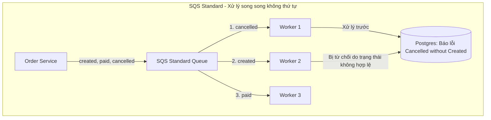
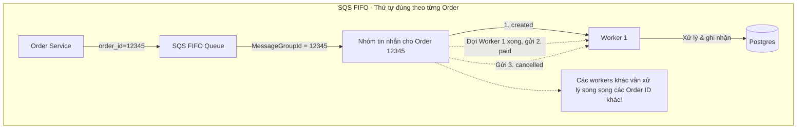

# Bài toán 07: Thứ tự sự kiện trong Message Queue (Event Ordering in a Message Queue)

---

## 1. Đặt ra vấn đề / tình huống (Problem Statement)

Dịch vụ đặt hàng (order service) của bạn xuất bản 3 sự kiện cho mỗi đơn hàng: `created` (đã tạo), `paid` (đã thanh toán), và `cancelled` (đã hủy).

Hệ thống sử dụng hàng đợi Amazon SQS tiêu chuẩn (Standard SQS Queue), với 5 consumers xử lý song song, lượng tải đạt khoảng **2,000 đơn hàng/phút** vào giờ cao điểm.

Tối qua, hệ thống production cảnh báo: Có 47 đơn hàng bị kẹt ở trạng thái "cancelled" mà không hề có bản ghi "created". Khách hàng đã được hoàn tiền cho những đơn hàng chưa bao giờ được ghi nhận là đã đặt thành công trên hệ thống. Bộ phận Tài chính đang rất không hài lòng.

**Bạn tìm hiểu nguyên nhân:**

- Đơn hàng được tạo, thanh toán và hủy chỉ trong vòng 400ms. Ba thông điệp (messages) được gửi lên SQS theo đúng thứ tự.
- Tuy nhiên, 3 consumers khác nhau đã nhận chúng gần như cùng lúc và xử lý song song. Sự kiện "cancelled" được xử lý trước tiên.
- Máy trạng thái (state machine) hạ nguồn sau đó từ chối sự kiện "created" vì coi là không hợp lệ (không thể tạo một đơn hàng đã bị hủy). Dữ liệu bị sai lệch nghiêm trọng.

**Thiết lập hiện tại:**
`OrderService` &rarr; SQS (Standard) &rarr; 5 Workers &rarr; PostgreSQL.

Bạn có thời hạn đến thứ Hai để khắc phục lỗi xử lý sai thứ tự sự kiện này. Bạn sẽ làm thế nào?

### Câu hỏi trắc nghiệm

Lựa chọn giải pháp nào sau đây là tối ưu nhất để khắc phục triệt để lỗi trên?

- **A.** **Chuyển sang SQS FIFO + MessageGroupId theo order_id** — để AWS tự động xử lý việc đảm bảo thứ tự trên từng đơn hàng.
- **B.** **Giữ nguyên SQS tiêu chuẩn, thêm số thứ tự (sequence number) + bộ đệm sắp xếp lại (reorder buffer) ở phía consumer** — giữ lại các sự kiện đến sai thứ tự cho đến khi các sự kiện trước đó được xử lý.
- **C.** **Thay thế luồng sự kiện bằng mô hình Saga** — mỗi bước phải đợi tín hiệu hoàn thành của bước trước đó trước khi kích hoạt bước tiếp theo.
- **D.** **Thêm phiên bản sự kiện (version/timestamp) và làm cho máy trạng thái có tính idempotent + không phụ thuộc vào thứ tự** — từ chối các chuyển đổi trạng thái cũ (stale transitions), chấp nhận bất kỳ thứ tự đến nào.

**ĐÁP ÁN ĐÚNG:** **A. Chuyển sang SQS FIFO + MessageGroupId theo order_id**

---

## 2. Trạng thái / Cấu hình của hệ thống hiện tại (Current System State / Configuration)

Hệ thống hiện tại sử dụng SQS Standard Queue kết hợp với cơ chế Polling song song trên nhiều luồng.

- **Bản chất của SQS Standard:** SQS Standard được thiết kế để mở rộng tối đa (unlimited throughput) nhưng **không đảm bảo thứ tự phân phối tuyệt đối (Best-effort ordering)**. Tin nhắn gửi sau có thể được phân phối trước.
- **Vấn đề Race Condition ở Consumer:** Khi 5 workers thực hiện poll tin nhắn song song từ một hàng đợi Standard, chúng sẽ nhận được các sự kiện khác nhau của cùng một đơn hàng cùng một lúc. Do tốc độ thực thi thread khác nhau, worker xử lý sự kiện `cancelled` hoàn thành ghi vào Postgres trước khi worker xử lý sự kiện `created` kịp chạy, tạo ra lỗi logic nghiêm trọng.



---

## 3. Thiết kế tổng quan (High-level Design)

Để giải quyết vấn đề, hệ thống không cần thiết phải đảm bảo thứ tự toàn cục (Global Ordering) trên toàn bộ tất cả các đơn hàng, mà chỉ cần bảo đảm **thứ tự xử lý tuần tự theo từng đơn hàng riêng lẻ (Local Ordering per Order)**.

Chúng ta chuyển dịch sang sử dụng **AWS SQS FIFO Queue** kết hợp với khóa phân nhóm **`MessageGroupId`**:



**Luồng hoạt động mới:**

1. Khi `OrderService` xuất bản sự kiện, nó sẽ gửi tin nhắn lên hàng đợi SQS FIFO, đồng thời gán thuộc tính `MessageGroupId` là giá trị **`order_id`**.
2. SQS FIFO cam kết: Các tin nhắn có cùng `MessageGroupId` sẽ luôn được xếp hàng tuần tự và chỉ được phân phối cho duy nhất một Consumer xử lý tại một thời điểm.
3. Khi Consumer xử lý xong tin nhắn trước (và xóa tin nhắn đó khỏi hàng đợi), SQS FIFO mới tiếp tục phân phối tin nhắn tiếp theo của nhóm đó. Nhờ vậy, chuỗi sự kiện `created -> paid -> cancelled` luôn được đảm bảo chạy đúng thứ tự trên Postgres.

---

## 4. Thiết kế chi tiết (Detailed Design)

### 4.1. Cấu hình MessageGroupId và MessageDeduplicationId

- **MessageGroupId (`order_id`):** Xác định nhóm tin nhắn. SQS FIFO sẽ tuần tự hóa toàn bộ các tin nhắn trong cùng nhóm. Các nhóm khác nhau (các `order_id` khác nhau) vẫn được phân phối song song cho các worker khác nhau để tối ưu hóa hiệu năng.

- **MessageDeduplicationId:** SQS FIFO yêu cầu thuộc tính chống trùng lặp tin nhắn trong vòng 5 phút (Deduplication Window).
  - _Cách 1:_ Bật **Content-based Deduplication** trên SQS Console. AWS sẽ tự động băm SHA-256 nội dung tin nhắn (`MessageBody`) để làm mã chống trùng lặp.
  - _Cách 2:_ Tự truyền thủ công `MessageDeduplicationId` từ phía Client bằng cách băm SHA-256 từ `order_id` + `status` + `timestamp` hoặc UUID để tránh trùng lặp do network retry.

### 4.2. Giới hạn Throughput và Hiện tượng Nghẽn đầu hàng (Head-of-Line Blocking)

- **Giới hạn Throughput (Throughput Limits):**
  - Mặc định, SQS FIFO hỗ trợ tối đa **300 transaction/giây** (gửi, nhận, xóa).
  - Nếu kích hoạt tính năng **High Throughput**, giới hạn này tăng lên đến **3,000 transaction/giây** (có batching) hoặc **300 req/s** không batching ở các vùng tiêu chuẩn.
  - Lượng tải cao điểm của bạn là 2,000 đơn hàng/phút (~33 đơn hàng/giây). Mỗi đơn hàng có 3 sự kiện, tương đương tối đa ~100 req/giây. Quy mô này hoàn toàn nằm trong giới hạn chịu tải an toàn của SQS FIFO mà không cần cấu hình phức tạp.

- **Xử lý Nghẽn đầu hàng (Head-of-Line Blocking) & DLQ:**
  - _Nguy cơ:_ Nếu một tin nhắn (ví dụ `paid` của đơn hàng `#123`) bị lỗi logic và không thể xử lý, nó sẽ chặn toàn bộ các tin nhắn tiếp theo của đơn hàng `#123` (như sự kiện `cancelled` phía sau).
  - _Giải pháp:_ Cấu hình hàng đợi phụ **Dead Letter Queue (DLQ)** cho SQS FIFO. Thiết lập thuộc tính `maxReceiveCount` ở mức thấp (ví dụ: 3 lần). Nếu một tin nhắn lỗi quá 3 lần, AWS SQS sẽ tự động chuyển tin nhắn lỗi đó sang DLQ, giúp giải phóng hàng đợi và cho phép các tin nhắn sau của đơn hàng đó tiếp tục chạy.

### 4.3. Ví dụ mã nguồn

#### TypeScript (AWS SDK v3 gửi tin nhắn FIFO)

```typescript
import { SQSClient, SendMessageCommand } from "@aws-sdk/client-sqs";
import crypto from "crypto";

const sqsClient = new SQSClient({ region: "us-east-1" });
const QUEUE_URL =
  "https://sqs.us-east-1.amazonaws.com/123456789012/order-events.fifo";

interface OrderEvent {
  orderId: string;
  status: "created" | "paid" | "cancelled";
  timestamp: number;
  payload: any;
}

export async function publishOrderEvent(event: OrderEvent) {
  const messageBody = JSON.stringify(event);

  // 1. Sinh MessageDeduplicationId thủ công bằng SHA-256 hash của nội dung tin nhắn
  const messageDeduplicationId = crypto
    .createHash("sha256")
    .update(messageBody)
    .digest("hex");

  // 2. Gửi tin nhắn kèm cấu hình MessageGroupId và MessageDeduplicationId
  const command = new SendMessageCommand({
    QueueUrl: QUEUE_URL,
    MessageBody: messageBody,
    MessageGroupId: event.orderId, // Gom nhóm theo ID đơn hàng
    MessageDeduplicationId: messageDeduplicationId, // Khóa chống trùng lặp
  });

  try {
    const response = await sqsClient.send(command);
    console.log(
      `[INFO] Đã gửi thành công sự kiện ${event.status} cho đơn hàng ${event.orderId}. MessageId: ${response.MessageId}`,
    );
  } catch (error) {
    console.error(`[ERROR] Gửi tin nhắn lên SQS FIFO thất bại:`, error);
    throw error;
  }
}
```

#### Java (Spring Boot + Spring Cloud AWS nhận tin nhắn FIFO)

```java
import io.awspring.cloud.sqs.annotation.SqsListener;
import org.springframework.stereotype.Service;
import org.slf4j.Logger;
import org.slf4j.LoggerFactory;

@Service
public class OrderEventConsumer {
    private static final Logger log = LoggerFactory.getLogger(OrderEventConsumer.class);

    // Spring Cloud AWS tự động poll và điều phối tin nhắn từ SQS FIFO.
    // Các tin nhắn có cùng MessageGroupId sẽ được xử lý đơn luồng, tuần tự theo đúng thứ tự gửi.
    @SqsListener(value = "order-events.fifo")
    public void handleOrderEvent(OrderEventPayload payload) {
        log.info("Nhận sự kiện: {} (Trạng thái: {}) cho đơn hàng ID: {}",
                 payload.getEventId(), payload.getStatus(), payload.getOrderId());

        try {
            // Gọi máy trạng thái xử lý DB (PostgreSQL)
            updateOrderStateInDatabase(payload);
            log.info("Xử lý thành công đơn hàng: {}", payload.getOrderId());
        } catch (InvalidStateTransitionException e) {
            // Lỗi logic nghiệp vụ không hợp lệ (không nên ném exception để tránh retry vô ích)
            log.warn("[WARN] Chuyển đổi trạng thái đơn hàng {} bị từ chối: {}",
                     payload.getOrderId(), e.getMessage());
        } catch (Exception e) {
            log.error("[ERROR] Lỗi hệ thống khi xử lý đơn hàng: {}", payload.getOrderId(), e);
            throw e; // Ném ra ngoại lệ để SQS kích hoạt cơ chế retry / DLQ giải phóng hàng đợi
        }
    }

    private void updateOrderStateInDatabase(OrderEventPayload payload) {
        // Luồng xử lý tuần tự trên Postgres: Created -> Paid -> Cancelled
    }
}
```

---

## 5. Các giải pháp & Đánh đổi (Solutions & Trade-offs)

Dưới đây là bảng phân tích so sánh các giải pháp xử lý thứ tự sự kiện:

| Tiêu chí                                | SQS FIFO + MessageGroupId _(Phương án A)_                                          | Reorder Buffer tại Consumer _(Phương án B)_                                             | Mô hình giao dịch Saga _(Phương án C)_                                     | Event Versioning / OCC _(Phương án D)_                                     |
| :-------------------------------------- | :--------------------------------------------------------------------------------- | :-------------------------------------------------------------------------------------- | :------------------------------------------------------------------------- | :------------------------------------------------------------------------- |
| **Tính bảo đảm thứ tự**                 | **Tuyệt đối (Cục bộ)**. Đảm bảo tất cả tin nhắn cùng đơn hàng xử lý đúng thứ tự.   | Khá tốt. Nhưng dễ bị lỗi nếu mất gói tin hoặc kẹt buffer.                               | Tuyệt đối. Nhờ thiết kế bước tuần tự đồng bộ.                              | Kém. Chỉ phát hiện lỗi chứ không tự động sắp xếp lại thứ tự sự kiện.       |
| **Đo mức độ phức tạp**                  | **Cực thấp**. Tận dụng hạ tầng quản lý sẵn có từ AWS SQS FIFO.                     | **Cực cao**. Phải tự code logic quản lý buffer, TTL cache, xử lý crash, giám sát nghẽn. | Cao. Phải thiết kế API bù trừ và luồng giao dịch đa dịch vụ.               | Cao. Đòi hỏi cấu trúc dữ liệu Event Sourcing hoặc bảng Audit log phức tạp. |
| **Khả năng mở rộng (Scale-out)**        | **Tốt**. Mở rộng parallel tối đa bằng số lượng MessageGroupId (số lượng đơn hàng). | Kém. Bị giới hạn bởi dung lượng bộ nhớ RAM trên từng consumer node.                     | Rất kém. Chuyển mô hình không đồng bộ thành gọi đồng bộ làm chậm hệ thống. | Tốt. Xử lý phân tán không trạng thái.                                      |
| **Khả năng chịu lỗi (Fault tolerance)** | **Tuyệt vời**. Hỗ trợ sẵn cơ chế Redrive Policy chuyển tin nhắn kẹt sang DLQ.      | Kém. Nếu node chứa buffer bị crash, dữ liệu đệm chưa ghi nhận sẽ bị mất sạch.           | Trung bình. Phải gọi rollback bù trừ phức tạp.                             | Tốt. Hệ thống tự động từ chối giao dịch cũ.                                |
| **Độ trễ xử lý (Latency)**              | Thấp. Chỉ tăng thêm vài mili-giây thời gian định tuyến hàng đợi của AWS.           | Trung bình. Do phải chờ đợi các tin nhắn trước trong buffer.                            | **Rất cao**. Phải đợi toàn bộ các bước RPC hoàn thành tuần tự.             | Thấp.                                                                      |

---

## 6. Explanation (Giải thích chi tiết & Lựa chọn tối ưu)

### Tại sao SQS FIFO (A) là giải pháp tối ưu nhất?

- **Giải quyết tận gốc vấn đề thứ tự cục bộ:** Hệ thống chỉ yêu cầu thứ tự xử lý của các sự kiện thuộc **cùng một đơn hàng** (`created -> paid -> cancelled`). SQS FIFO với `MessageGroupId` là `order_id` đáp ứng hoàn hảo yêu cầu này: Nó ép buộc tất cả tin nhắn của đơn hàng đó đi qua 1 worker tuần tự mà không làm ảnh hưởng đến khả năng xử lý song song của các đơn hàng khác nhau trên các worker khác nhau.

- **Chi phí triển khai cực thấp:** Bạn không cần phải viết thêm hàng ngàn dòng code phức tạp để tự xây dựng bộ đệm sắp xếp, không cần quản lý RAM, không lo mất dữ liệu khi crash server. AWS SQS tự động vận hành và đảm bảo mọi thứ.

### Phân tích chi tiết các lựa chọn không tối ưu khác

- **Reorder Buffer tại Consumer (B) - Cái bẫy tự viết lại bánh xe:**
  Việc lưu các sự kiện đến sai thứ tự vào một buffer bộ nhớ tạm thời của ứng dụng để chờ sự kiện trước đó là một giải pháp cực kỳ rủi ro. Bạn sẽ phải tự code cơ chế dọn dẹp RAM (TTL), cơ chế phục hồi dữ liệu khi node bị crash đột ngột (nếu mất điện, dữ liệu đang lưu trong buffer sẽ bay màu), và xử lý kịch bản nếu sự kiện `created` bị thất lạc hoàn toàn thì buffer sẽ bị kẹt mãi mãi (rò rỉ RAM).
- **Mô hình Saga (C) - Dùng búa tạ đập ruồi:**
  Saga là mẫu thiết kế dành cho các giao dịch phân tán phức tạp trên nhiều Microservices (ví dụ đặt phòng khách sạn kèm thanh toán và đặt vé máy bay). Việc áp dụng Saga chỉ để cập nhật trạng thái của một thực thể `order` duy nhất trong cùng một cơ sở dữ liệu là quá phức tạp, biến luồng xử lý không đồng bộ hiệu năng cao thành luồng gọi RPC đồng bộ chậm chạp và làm tăng độ liên kết (coupling) không đáng có giữa các dịch vụ.
- **Event Versioning (D) - Chỉ giải quyết được một nửa và gây mất dữ liệu:**
  Nếu bạn áp dụng đánh số phiên bản sự kiện, khi sự kiện `cancelled` đến trước, máy trạng thái sẽ cập nhật trạng thái đơn hàng thành "đã hủy". Sau đó, sự kiện `created` đến muộn sẽ bị máy trạng thái từ chối thẳng thừng vì trạng thái đích không hợp lệ. DB của bạn cuối cùng sẽ lưu thông tin một đơn hàng bị hủy nhưng hoàn toàn trống trơn thông tin người mua, chi tiết mặt hàng (do sự kiện tạo đơn bị drop). Điều này làm hỏng tính toàn vẹn của dữ liệu báo cáo tài chính.
